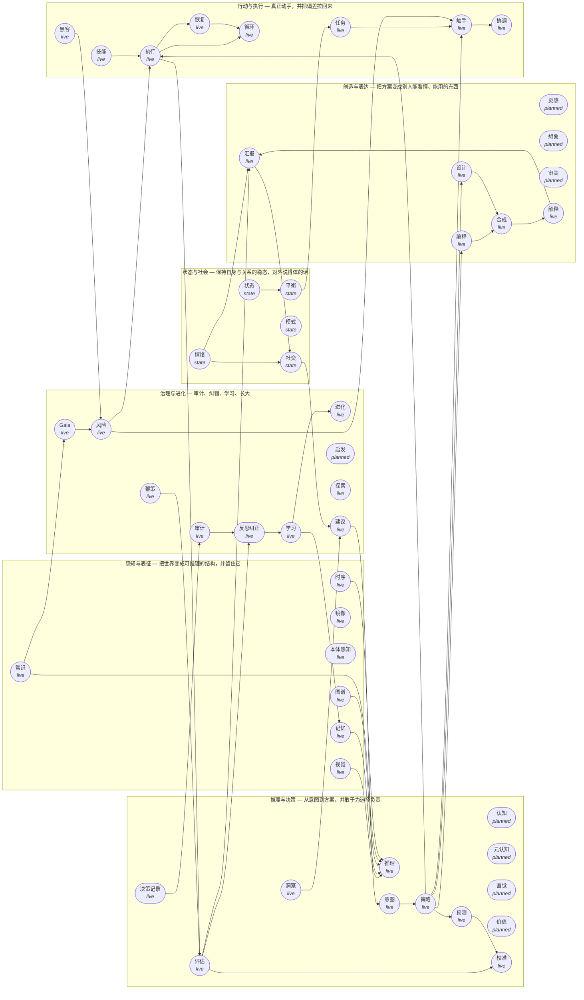

# GBT小土豆V9 · 认知系统架构（50 模块 / 6 组 / 9 步主流程）

> 本文由 `tools/gen_cognition_doc.py` 从 `core/cognition_system.py` 生成，与代码同源；
> 校验：模块 50 · 组 6 · 悬空输入 0 · 悬空边 0 · ok=True · 已接代码 41 项 / planned 9 项


## 一、分组与职责边界

| 组 | 职责（为什么存在） | 模块数 | 成员 |
|---|---|---|---|
| **感知与表征** | 把世界变成可推理的结构，并留住它 | 7 | 视觉、镜像、本体感知、记忆、时序、图谱、常识 |
| **推理与决策** | 从意图到方案，并敢于为选择负责 | 12 | 推理、认知、意图、元认知、直觉、策略、价值、预测、校准、决策记录、评估、洞察 |
| **创造与表达** | 把方案变成别人能看懂、能用的东西 | 8 | 编程、设计、灵感、想象、审美、合成、解释、汇报 |
| **行动与执行** | 真正动手，并把偏差拉回来 | 8 | 执行、触手、黑客、技能、任务、协调、恢复、循环 |
| **状态与社会** | 保持自身与关系的稳态，对外说得体的话 | 5 | 状态、平衡、模式、情绪、社交 |
| **治理与进化** | 审计、纠错、学习、长大 | 10 | 风险、审计、反思纠正、学习、进化、Gaia、鞭策、建议、启发、探索 |

## 二、模块清单（职责 / 输入 → 输出 / 实现落点）

| 模块 | 组 | 职责 | 输入 → 输出 | 实现落点 |
|---|---|---|---|---|
| 视觉 | 感知与表征 | 把屏幕/图像变成元素与坐标（纯视觉可操作） | 屏幕 → 元素清单、坐标 | `core/gui_perception.py` |
| 镜像 | 感知与表征 | 自我模型：我做过的操作与账本记录对得上吗 | 决策记录 → 自我一致结论 | `body/registry.py` |
| 本体感知 | 感知与表征 | 感知自身组件与健康（触手数、队列、显存、见证票） | 状态 → 健康画像 | `body/tools/collect.py` |
| 记忆 | 感知与表征 | 长期存储与召回（命名空间隔离，本体可跨空间读） | 经验 → 召回条目 | `core/isolated_bus.py::MemoryStore` |
| 时序 | 感知与表征 | 时间口径统一与顺序性（先后、时长、窗口） | 事件 → 时间线 | `common/timeutil.py` |
| 图谱 | 感知与表征 | 实体与关系的结构化索引（谁依赖谁、谁负责哪页） | 记忆、触手 → 关系图 | `body/history.py` |
| 常识 | 感知与表征 | 不证自明的约束（不删用户数据、不越权、不编数） | 意图 → 约束检查 | `AGENTS.md/规约 + body/net_guard` |
| 推理 | 推理与决策 | 从前提推出下一步（可解释、可复查） | 元素清单、记忆 → 候选动作 | `core/gui_agent.py` |
| 认知 | 推理与决策 | 把多源信息合成一个当前世界观（认知态） | 元素清单、召回条目 → 世界观 | `**planned（未实现，明说）**` |
| 意图 | 推理与决策 | 解析主人指令的真实意图并拆分任务 | 指令 → 任务树 | `core/commander.py::compile_task` |
| 元认知 | 推理与决策 | 对自身推理的监控（我确定吗？该不该交给别人？） | 候选动作 → 置信度、交棒建议 | `**planned（未实现，明说）**` |
| 直觉 | 推理与决策 | 快思考：用历史模式给低成本的初判（可被复核推翻） | 记忆 → 初判 | `**planned（未实现，明说）**` |
| 策略 | 推理与决策 | 多步计划与取舍（成本/收益/风险） | 任务树、世界观 → 计划DAG | `core/commander.py::plan` |
| 价值 | 推理与决策 | 排序依据（对主人是否真的有用、是否损害信任） | 计划DAG → 取舍口径 | `**planned（未实现，明说）**` |
| 预测 | 推理与决策 | 对结果的量化预期（ETA、命中率、金额） | 计划DAG、时序 → 预期值 | `panel/trends.py` |
| 校准 | 推理与决策 | 把「预测 vs 实际」对齐，纠正系统性偏差 | 预期值、评估 → 校准后的预期 | `body/calibration.py` |
| 决策记录 | 推理与决策 | 每次选择留痕（谁决定、凭什么、结果如何） | 取舍口径 → 决策条目 | `audit/ledger.py` |
| 评估 | 推理与决策 | 对结果打分（达标/未达标 + 证据） | 执行结果 → 评分、差距 | `audit/stack_acceptance.py` |
| 洞察 | 推理与决策 | 从历史里找出非显而易见的关联与机会 | 决策条目、图谱 → 洞察条目 | `body/history_query.py` |
| 编程 | 创造与表达 | 把方案变成能跑的代码（含测试与回滚） | 计划DAG → 代码变更 | `skills/engine.py` |
| 设计 | 创造与表达 | 信息与视觉的组织（版式、层级、留白） | 计划DAG → 版式稿 | `skills/diagram.py` |
| 灵感 | 创造与表达 | 发散候选方案（先多后选，不怕怪） | 意图 → 候选方案 | `**planned（未实现，明说）**` |
| 想象 | 创造与表达 | 对未发生场景的模拟（失败演练、预案） | 策略 → 预案 | `**planned（未实现，明说）**` |
| 审美 | 创造与表达 | 对「好不好看/好不好用」的判据 | 版式稿 → 审美意见 | `**planned（未实现，明说）**` |
| 合成 | 创造与表达 | 把素材合成为交付物（图/视频/文档） | 版式稿、素材 → 交付物 | `skills/video.py` |
| 解释 | 创造与表达 | 把技术事实翻译成人话（含「为什么这么做」） | 决策条目、评分 → 解释文本 | `core/commander.py::render_prompt` |
| 汇报 | 创造与表达 | 定时/按事的进展与风险汇报（面板 + 语音） | 评估、情绪 → 汇报 | `panel/alerts.py` |
| 执行 | 行动与执行 | 把动作真的做出去（人类操作模式，带风险门） | 候选动作 → 执行结果 | `core/actuator.py` |
| 触手 | 行动与执行 | 执行末端编队：统一密钥 + 指挥官工单 + rpm 桶 | 计划DAG → 并行产出 | `core/tentacle_fleet.py` |
| 黑客 | 行动与执行 | 对抗性视角：主动找自己的漏洞与绕过路径（防守用） | 代码变更、约束检查 → 攻击面清单 | `scan/cross_scan.py` |
| 技能 | 行动与执行 | 可复用能力包（声明 spec，编辑器可校验） | 任务树 → 能力调用 | `skills/caps/registry.py` |
| 任务 | 行动与执行 | 任务的排队、领取、重试、死信 | 计划DAG → 任务状态 | `media/queue.py` |
| 协调 | 行动与执行 | 多触手之间的分工与消息（谁做哪片、结果汇总） | 并行产出 → 汇总结果 | `core/mesh.py` |
| 恢复 | 行动与执行 | 失败后的自愈（重试/回滚/降级/断点续跑） | 执行结果 → 恢复动作 | `body/recheck.py` |
| 循环 | 行动与执行 | 反馈闭环（观察→计划→执行→验证→再观察） | 执行结果、评分 → 下一轮观察 | `core/gui_agent.py::run` |
| 状态（状态类） | 状态与社会 | 全局快照（每个域的读数与新鲜度） | 健康画像 → 快照 | `body/tools/collect.py` |
| 平衡（状态类） | 状态与社会 | 资源与节奏的稳态（显存/队列/并发/节流） | 快照 → 节流指令 | `media/scheduler.py` |
| 模式（状态类） | 状态与社会 | 识别当前工作模式（对答/执行/告警/休眠）并按模式换策略 | 快照、情绪 → 模式标签 | `**planned（未实现，明说）**` |
| 情绪（状态类） | 状态与社会 | PAD 情感状态：随真实事件起伏，影响语气与措辞 | 真实事件 → 情绪状态、语气 | `body/emotion.py` |
| 社交（状态类） | 状态与社会 | 与主人的关系状态（熟悉度/信任/互动史）与得体应对 | 互动 → 关系状态、措辞、建议 | `body/social.py` |
| 风险 | 治理与进化 | 高风险动作的执行前闸门与确认要求 | 候选动作 → 放行/拦截 | `core/actuator.py::CONFIRM_PATTERNS` |
| 审计 | 治理与进化 | 一切关键动作留痕（谁、何时、凭什么、结果） | 执行结果、决策条目 → 审计链 | `audit/ledger.py` |
| 反思纠正 | 治理与进化 | 事后复盘并把教训写回规则（下次不再犯） | 评分、差距 → 规则修订 | `body/witness_alerts.py` |
| 学习 | 治理与进化 | 把经验固化成可复用知识（技能/偏好/坑） | 规则修订 → 知识条目 | `body/history.py` |
| 进化 | 治理与进化 | 版本化自我升级（迁移/新能力/回滚点） | 知识条目 → 新版本 | `migrations/runner.py` |
| Gaia | 治理与进化 | 全局基座：地球级常识与全局约束（一票否决权） | 约束检查 → 全局裁决 | `CONSTITUTION.md/规约` |
| 鞭策 | 治理与进化 | 对自身进度的催促（落后就加力，不装看不见） | 预期值、评分 → 催办 | `body/coverage_watch.py` |
| 建议 | 治理与进化 | 主动给主人可执行建议（含「要不要做/值不值」） | 洞察条目、关系状态 → 建议 | `body/social.py` |
| 启发 | 治理与进化 | 从别处借方法（跨域迁移：把A域解法用到B域） | 洞察条目 → 候选方法 | `**planned（未实现，明说）**` |
| 探索 | 治理与进化 | 主动试新（低风险实验 + 结果回收） | 候选方法 → 实验结论 | `parity/run.py` |

> 仍属 planned 的模块：认知、元认知、直觉、价值、灵感、想象、审美、模式、启发（这些是「还没有独立实现」的认知能力，按纪律标注，不冒充）。


## 三、模块间数据流（谁喂谁）



主干边清单：

```
视觉 → 推理
记忆 → 推理
图谱 → 推理
常识 → 推理
时序 → 推理
本体感知 → 认知
镜像 → 认知
意图 → 策略
策略 → 预测
价值 → 策略
直觉 → 策略
想象 → 策略
灵感 → 策略
元认知 → 策略
策略 → 执行
策略 → 触手
触手 → 协调
执行 → 恢复
任务 → 触手
技能 → 执行
执行 → 循环
恢复 → 循环
执行 → 评估
评估 → 校准
预测 → 校准
评估 → 反思纠正
评估 → 汇报
决策记录 → 审计
审计 → 反思纠正
反思纠正 → 学习
学习 → 进化
学习 → 记忆
策略 → 编程
策略 → 设计
编程 → 合成
设计 → 合成
审美 → 设计
合成 → 解释
解释 → 汇报
状态 → 平衡
平衡 → 任务
状态 → 模式
情绪 → 社交
风险 → 执行
风险 → 触手
Gaia → 风险
常识 → Gaia
黑客 → 风险
探索 → 启发
洞察 → 启发
洞察 → 建议
社交 → 建议
汇报 → 社交
鞭策 → 评估
模式 → 情绪
情绪 → 汇报
建议 → 意图
```


## 四、协作主流程（一次真实任务怎么走）

**1. 听清** — 参与：意图、常识、Gaia
> 解析主人指令的真实意图，先用常识与全局约束过一遍（越权/毁数据直接否）

**2. 看准** — 参与：视觉、本体感知、状态、记忆、图谱、时序
> 纯视觉取元素与坐标 + 自身健康画像 + 召回相关历史（不靠猜）

**3. 想透** — 参与：认知、元认知、直觉、灵感、策略、价值、想象、预测
> 合成世界观 → 发散候选 → 用价值与元认知收敛成计划，并给出可量化预期

**4. 授权** — 参与：风险、镜像、决策记录
> 高风险动作过闸门（要主人授权）、检查自我一致性、把这次决定记账

**5. 动手** — 参与：触手、任务、技能、执行、协调、黑客
> 编队分工（统一密钥 + 指挥官工单）→ 排队执行 → 人类操作模式落鼠标键盘 → 交叉互扫找自己的洞

**6. 验证** — 参与：评估、校准、恢复、循环
> 回读验证 + 打分 + 和预期校准；不达标就恢复/重试，闭环进入下一轮

**7. 交付与说清** — 参与：编程、设计、合成、审美、解释、汇报
> 把结果做成能用的交付物，用人话解释清楚（含为什么这么做）

**8. 成长** — 参与：反思纠正、学习、记忆、进化、洞察、启发、建议、鞭策
> 复盘写回规则 → 固化成知识 → 版本化升级；顺手给主人可执行建议

**9. 有情绪地相处** — 参与：情绪、社交、模式、平衡、状态
> 全程情绪随真实事件起伏、按模式换策略、保持资源稳态，说得体的话


## 五、触手吸收（每根触手可调用全部 50 项）

`core/cognition_system.TentacleGrasp` 把 50 个模块登记为**本体全部能力**：每根触手（含 100 根编队）各持一份完整清单，`can(触手, 模块)` 可核对；调用执法由 `core/commander.py::call_as` 与 `core/tentacle_fleet.py` 的指挥官工单闸门承担。


## 六、触手永久记忆（Obsidian 接入）

`body/obsidian.py`：库从 `%APPDATA%\obsidian\obsidian.json` 自动发现，
**排除 V8 与 Sandbox**；写入落在命名空间子目录 `GBT小土豆V9-触手记忆/触手/GBT-D{n}.md`，
绝不铺在库根；主脑全库可读可检索；触手记忆为**追加式**（只增不改）。
路径经 `normpath` + 前缀断言，`../` 越界一律拒。
